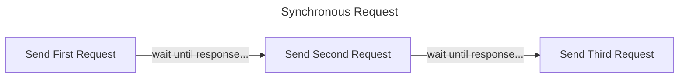
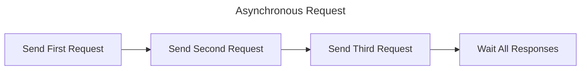

# La Seine

Simple 42 api async request library with rate limit management.

# Advantages of using La Seine

## Asynchronous Request

Some of 42 api endpoints are very slow. For example, '/scale_teams' endpoint needs more than 10 seconds in one request!<br/>
So, if we send requests synchronously, it'll take incredibly long time.

---

---
Let's assume that single request - response takse 10 seconds.<br/>
Above example, we'll need to wait more than 30 seconds. But if we send requests asynchronously, we can save much time.

---

---
With asynchronous approach, we just need to wait about 10 seconds!

## Rate Limit Management
But still, we need to take care about rate limits. Means we can't just send all requests at once. La Seine takes care of this for us, so we don't need to care about limits when sending requests.

## Multiple Api Client Support
La Seine supports multiple api clients. We can add multiple clients to La Seine, and La Seine will picks client automatically at request.

## Auto Abort System
Assume we are sending requests with non-exist url. Api server will send responses with 404 status every time, and this is neither good to 42 api server nor our application. In this case, La Seine aborts all pending requests and return results. Fulfilled responses still remain in the responses property of SeineResult.

# Install


```
npm i la-seine
```
or
```
pnpm add la-seine
```
# Usage Example


```ts
import seine from 'la-seine';

// 1. Add api client. (You can add mutliple clients here.)
await seine.addApiClient({
  clientId: 'id-string',
  clientSecret: 'secret-string',
});

// 2. Add requests.
for (let i = 0; i < 10; i++) {
  seine.addRequest(`https://api.intra.42.fr/v2/scale_teams?page[number]=${i}`);
}

// 3. Await for results.
const result = await seine.getResult();

// 4. Check result status and use data as you want.
if (result.status === 'success') {
  for (const response of result.responses) {
    const data = await response.json();
    console.log(data);
  }
}
```
