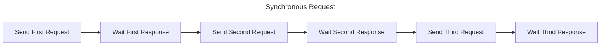
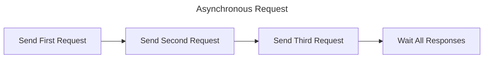

# La Seine

Simple 42 api async request library with rate limit management.

## Advantages of using La Seine

### Asynchronous Request

Some of 42 api endpoints are very slow. For example, '/scale_teams' endpoint needs more than 10 seconds in one request!<br/>
So, if you send requests synchronously, it'll take incredibly long time.


Let's assume that single request - response takse 10 seconds.<br/>
Above example, you'll need to wait more than 30 seconds. But if you send requests asynchronously, you can save much time.


With asynchronous approach, you just need to wait about 10 seconds!

### Rate Limit Management
But still, you need to consider about rate limits. Means you can't just send all requests at once. La Seine manages this for you, so you don't need to care about limits when sending requests.

### Multiple Api Client Support
La Seine supports multiple api clients. You can add multiple clients to La Seine, and La Seine will pick client automatically during request.

### Auto Abort System
Assume you are sending requests to non-existing url. Api server will send 404 status response for each time, and this is neither good to 42 api server nor our application. In this case, La Seine aborts all pending requests and return results. The SeineResult will return the fulfilled responses in responses property form. (See below example.)

## Install


```
npm i la-seine
```
or
```
pnpm add la-seine
```
## Usage Example


```ts
import seine from 'la-seine';

// 1. Add api client. (You can add mutliple clients here.)
await seine.addApiClient({
  clientId: 'id-string',
  clientSecret: 'secret-string',
});

// 2. Add requests.
for (let i = 0; i < 10; i++) {
  seine.addRequest(`https://api.intra.42.fr/v2/scale_teams?page[number]=${i}`);
}

// 3. Await for results.
const result = await seine.getResult();

// 4. Check result status and use data as you want.
if (result.status === 'success') {
  for (const response of result.responses) {
    const data = await response.json();
    console.log(data);
  }
}
```
